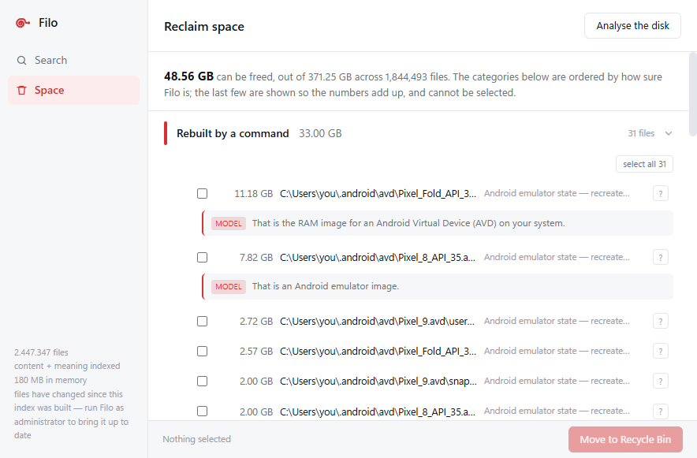

<p align="center">
  
</p>

<h1 align="center">Filo</h1>

<p align="center">
  Find files on Windows by name, by what is written inside them, and by what
  they are about.<br>
  Entirely on your own machine. No service, no cloud, no account.
</p>

---

Filo is one C++ executable with nothing beside it. It reads the whole file table
of the disk into memory, indexes the text of everything worth opening, and — if
you give it a model — embeds that text so a search for `penalty` can find a
contract that only ever says `liquidated damages`.

The name is Italian for *thread*: Ariadne's, the one that leads back out.

## What it does

**Finds files by name.** The whole volume, in memory, answering in about 13 ms.

**Finds files by their text.** PDF, DOCX, XLSX, PPTX, HTML, RTF, EPUB, source
code, plain text. Extracted once, indexed with FTS5, with a tokenizer that folds
accents and stems both English and Italian, so `resume` finds `résumé` and
`contracts` finds `contract`.

**Finds files by meaning.** Every chunk of text gets an embedding, so the words
in your query need not appear in the document at all.

**Answers questions.** With a small instruction model present, *"where is the
rental contract I signed"* is read as a question and turned into a search, a
format and a date range — rather than a hunt for the literal word "signed".

**Shows where the disk went, and never decides for you.**



## The models, and what they are allowed to do

This is the part worth being precise about, because "AI file search" usually
means a model is deciding things it has no business deciding.

Filo uses two small models, both local, both optional, and each one is fenced
in.

### The embedding model — about 115 MB

Turns text into a vector, so nearby meanings sit near each other. It produces
one of the three result lists; the other two are names and words. The three are
fused by rank, and a meaning vote is worth **half** a word vote — if the words
are in the document that is a fact, and if a vector is nearby that is a model's
opinion.

It never chooses, filters or hides. It votes, and it is outvoted often.

### The instruction model — roughly 2 GB

**Reading a question.** It is handed a sentence and returns three fields: the
subject to search for, a format, and a time. Every one of them comes from a
closed list, and the reply is forced through a **GBNF grammar**, so the model
physically cannot emit anything outside those enumerations. The worst it can do
is pick the wrong option from a list we wrote — never invent a date format
nothing parses. If any part of the call fails, the query plan is left exactly as
it was.

It is asked as rarely as possible: only when the query looks like a question
**and** names, full text and meaning have all come back with nothing. Running it
first, before the cheap layers, was a real bug and cost a second on every
question-shaped query.

**Saying what a file is.** On the Space screen, most of what you read is a rule
Filo can defend — *inside node_modules*, *an installer downloaded 8 months ago*.
For a large file the rules do not recognise, a `?` asks the model.

That answer is the one place in the whole program where a model writes prose
nothing checks, about a file you are deciding whether to delete. So:

- it is labelled **MODEL**, visually apart from the rule-based reason beside it;
- the prompt forbids it from saying whether the file is safe to delete.

That last rule was learned the hard way. Asked for a deletion verdict, the model
called a 4 GB game asset archive *"a save game file created by the game's Forge
mode"* — a mode that does not exist — and said an Android emulator disk could go
without losing anything. Safe-to-delete is the classifier's job, and the
classifier can show its working.

**With neither model, Filo still finds files by name and by content.** See
[docs/models.md](docs/models.md).

## Five layers, and each one is optional

This is the shape of the program, not a set of fallbacks bolted on afterwards.
On a machine that has just cloned the repository, none of the optional layers
are there, and the search box still works.

| Layer | What it needs | What you lose without it |
|---|---|---|
| Names | nothing | — |
| Content | one indexing pass | search inside documents |
| Words | the same pass | stemming, accent folding |
| Meaning | an embedding model + one pass | the third result list |
| Questions | an instruction model | whole sentences, file explanations |

The window says where you stand in its status line: *files indexed*, then
*content indexed*, then *content + meaning indexed*.

## Why it is built this way

**The file table, not a directory walk.** NTFS already keeps every file and
folder in one internal table, the MFT. Asking the driver to dump it takes
seconds; recursing through directories to learn the same thing takes minutes.
The price is that reading it needs administrator rights, and that price is real
— see below.

**Arrays, not objects.** The index is a structure of arrays: names in one
contiguous pool, offsets and lengths beside it, everything else in its own
array. Search reads only the names, so it never drags file reference numbers and
attribute masks through the cache to look at a name. No `std::wstring` per file,
no allocation per file.

**The journal first, a watcher as the fallback.** NTFS logs every create, delete
and rename with a sequence number, and the saved index remembers the number it
reached — so Filo asks only for the difference, at startup and then every thirty
seconds while the window is open. When the journal is out of reach it watches
the user's profile with `ReadDirectoryChangesW`, which needs no rights.

**One executable.** Static CRT, SQLite compiled in, the static WebView2 loader,
the interface embedded as a string. Nothing to place next to the binary and no
Visual C++ redistributable to chase on a fresh PC.

**Parsers in another process.** Every document format is offset arithmetic over
bytes of unknown origin. They run in worker processes under a job object, with a
watchdog for the loops the other guards miss. A malformed archive costs one
worker, which restarts itself.

**A flat vector scan, not an approximate index.** At this size, a full scan of
int8 vectors across the cores costs a few milliseconds. An approximate index
would buy a training step, periodic rebuilds, precision drift and a pre-1.0
dependency, to solve a problem the data does not have.

**Filters never remove anything.** *"the march contract in pdf"* carries a
subject, a format and a date, and the format and the date are lifted out of the
text — otherwise Filo hunts for the word "pdf" inside documents. But a satisfied
filter only adds score. A filter that excludes can hide the right answer, and it
hides it silently: an empty list looks like a broken program.

**Whose file it is, before what the file is.** On the Space screen ownership is
a gate, not one rule among others: outside your profile, or inside a folder an
application manages, and nothing else gets asked. A generated tree —
`node_modules`, `target/debug` — is offered whole, and only when nothing else in
the project has been touched for six months, measured from the source beside it
rather than from the tree, whose dates move on every install. Never one file out
of a tree: `npm install` will not repair a package folder that already exists,
so half a tree is worse than all of it.

**The space screen never decides.** It groups, explains and waits. No
"safe to delete" score, because a number invites automation and automation is
the one thing that must not happen where the action is irreversible. Nothing is
ever pre-selected. Deletion means the Recycle Bin and nothing else, and every
file is re-verified through an open handle at the moment it goes.

## Numbers, from one machine

Measured on the development machine, once, on one real disk. They are what
happened there, not a promise about anywhere else.

| | |
|---|---|
| MFT records enumerated | 2.4 million in 6.3 seconds |
| Files held in the index | 2,447,347, about 180 MB of memory |
| A search | about 13 ms, out of the in-memory index |
| Embedding vectors | 579,190 of 384 dimensions, quantised to int8, 231 MB |
| The embedding pass | 74 minutes, 94.5% of it the model itself |
| Space screen, on a 372 GB disk | 48.6 GB it could offer, of which 5 GB from duplicates alone |

That last row is worth reading twice. Duplicate detection is the part every disk
cleaner has, and here it accounts for about a tenth of what the screen finds,
because knowing that four PDFs are byte identical is a much smaller thing than
knowing what each of them is.

The figure has been down as well as up: it was 52 GB until the classifier
started asking whose file something was before asking what it was. A Windows log
matched *"written by a program"* several rules before anything checked the
owner, and came out with a checkbox beside it. Losing four gigabytes of offers
was the fix working.

## The administrator problem

Reading the MFT and the USN journal both mean opening the volume itself, and
Windows only allows that to an elevated process. There is nothing in Filo that
can work around it.

- **On an ordinary account the first run fails.** There is no snapshot yet, so
  Filo tries to read the MFT, is refused, and exits.
- **After that, the index goes stale.** It will load and search happily without
  elevation, but the journal catch-up needs the same handle.

Filo does not hide this. Without the journal it watches the profile instead, and
the moment anything changes there the status line says *files have changed since
this index was built — run Filo as administrator to bring it up to date*. Worse
than a fresh index; much better than a stale one that looks fresh.

Two things need no rights at all: files Filo moves to the Recycle Bin itself are
struck out of the index immediately, because it already knows which ones they
were; and everything derived rather than observed — the text index, the
vectors — is built by reading files, not the volume.

## Reading the code

If you came here to look rather than to install, the comments are the point.
Nearly every one of them records a bug that was actually hit, and says what goes
wrong without the line beneath it. A few worth opening:

| | |
|---|---|
| `src/ntfs/mft_enumerator.cpp` | reading two and a half million records out of NTFS |
| `src/index/file_index.h` | the structure-of-arrays index, and why a rename must keep its slot |
| `src/store/tokenizer.cpp` | why indexing and querying are not symmetric |
| `src/content/chunker.cpp` | estimating tokens without a tokenizer, and the measurement that sets the budget |
| `src/search/query_model.h` | what the language model is not allowed to do |
| `src/reclaim/classify.cpp` | deciding whose file it is before deciding what it is |
| `src/reclaim/recycle.cpp` | why `FOF_ALLOWUNDO` is a request, not a guarantee |

## Where help would matter

Real problems, honestly scoped:

- **Applying watched changes to the index.** The folder watcher notices that the
  index has gone out of date but cannot correct it, because applying a change by
  path needs a path lookup the index does not have. Either add one, or
  re-enumerate the affected directory and reconcile.
- **Legacy Office.** `.doc`, `.xls` and `.ppt` are recognised and then skipped.
  There is no extractor.
- **OCR.** A PDF that is a scan is reported as needing OCR. There is no OCR.
- **More than one volume at a time.** The drive letter is an argument and
  defaults to `C:`.
- **A privileged helper**, so the index can be built and refreshed without
  running the whole interface elevated.
- **Other languages.** The stemmers and the stopword lists are English and
  Italian; the evaluation corpus is Italian. The machinery is not.

## Running it

Build first — [docs/building.md](docs/building.md) — then, from an elevated
prompt:

```
build\Filo.exe                     open the window on C:
build\Filo.exe D:                  another volume
build\Filo.exe C: invoice          search names from the command line
build\Filo.exe C: --index          build or update the content index
build\Filo.exe C: --embed <model>  compute the embeddings (long, resumable)
build\Filo.exe C: --rescan         ignore the snapshot and read the MFT again
build\Filo.exe --selftest          check the build; needs nothing installed
```

Inside the window: type to search, arrow keys to move, Enter to open,
Ctrl+Enter to show in the folder, Escape to clear and then to hide.

## Where Filo puts things

Everything lives in `%LOCALAPPDATA%\filo`:

| | |
|---|---|
| `index-C.bin` | the name index for drive C, saved between runs |
| `content-C.db` | the text index, plus its `-wal` and `-shm` files |
| `content-C.db.vec` | the embedding vectors |
| `*.gguf` | models, if you put any there |
| `recycled.log` | what the Space screen moved to the Recycle Bin, and when |
| `ui-diag.log` | interface diagnostics |

Nothing in there is precious except the models: the index, the text database and
the vectors are all derived from the disk and can be built again.

## Third-party code

Vendored under `third_party/`, so the default build fetches nothing: **SQLite**
(public domain) with FTS5, **Snowball** (BSD-3) for the two stemmers,
**libdeflate** (MIT) decompression only, **xxHash** (BSD-2), and the
**WebView2** SDK headers with the static loader.

Two more are optional and built separately, because both are large checkouts:
**PDFium** for PDF text and **llama.cpp** for the models. Neither is required to
build or to run.

## Licence

MIT — see [LICENSE](LICENSE). The vendored dependencies are all compatible with
it: SQLite is public domain, Snowball is BSD-3, libdeflate is MIT and xxHash is
BSD-2.

## Documentation

- [docs/building.md](docs/building.md) — building it, with and without the
  optional dependencies.
- [docs/models.md](docs/models.md) — how the models are found, what each one
  buys, what it costs.
- [docs/reclaim-design.md](docs/reclaim-design.md) — the design of the Space
  screen, and why it is allowed to be so cautious.
